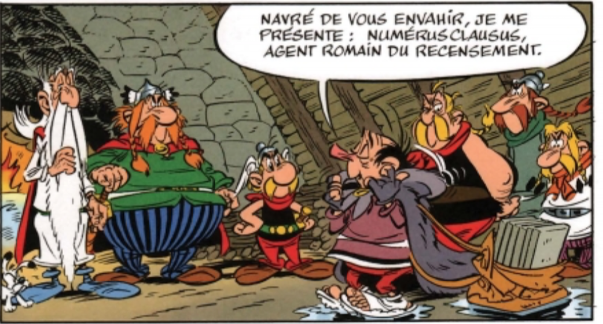

class: center, middle
background-position: 50% 50%

# Data
## The data in *data science*
   
## Mathieu Morey, Datactivist
### mathieu@datactivist.coop

### 2020-09-14
---

class: center, middle

These slides online : `r paste0("http://moreymat.github.io/", params$slug)`

Sources : `r paste0("https://github.com/moreymat/ecm-cse-csds/", params$slug)`

Adapted from original content by Samuel Goëta and Joël Gombin (Datactivist).
Productions by Datactivist are freely reusable under the terms of the [Creative Commons 4.0 BY-SA](https://creativecommons.org/licenses/by-sa/4.0/legalcode.fr) license.

 
 

---
## Datactivist : Who we are

    

### We .red[open data], we make them .red[useful]

---
## Datactivist : Who we are

---
## Datactivist : Who we are

- Datactivist is a .red[**pure player in open data**] launched in 2016, by Samuel Goëta et Joël Gombin.

<!-- TODO translate  -->
- We work on .red[**all the steps in the process of opening data**], with data producers and re-users.

- We apply to ourselves our own .red[**values**] : we are a worker cooperative ; our training material and content are freely reusable, published under a Creative Commons license.

- Our approach stems from research, see **https://datactivist.coop/these**. 

- We host and run the [#TeamOpenData](https://teamopendata.org) community on (mostly French) open data.

---
## Datactivist : What we do

- Consulting on .red[**strategies to open data**] : we help organisations in designing and implementing their strategy to open data.

- .red[**Assisting the reuse of open data**] : we help organisations to use data in their daily operations. 

- .red[**Raising awareness and training on data**] : we teach data literacy, the general principles and best practices of open data, and introduce to data science. 

- .red[**Data facilitation**] : we host and run hackathons, open data camps, data expeditions...

???

La médiation de données est aussi fondamentalement une animation de communauté(s). 

---
class:middle, center
## Warm up : 5 minutes, 20 data points

You have 5 minutes.

You must find 20 data points in your immediate surroundings.

(You cannot use any electronic device)

.footnote[[source](http://infolabs.io/5-minutes-20-donnees)]

---
class:center,inverse, middle
# What is a data point ?
---
class:center,inverse, middle
# According to you... ?
---
# The Roman censor, ancestor of statistics
.reduite3[]

.footnote[Source : *Asterix chez les pictes*, © Albert René 2013]
---
# The Roman censor, ancestor of statistics
.reduite3[]

.footnote[*Asterix chez les pictes*, © Albert René 2013]
---
## Statistics : government and proof
.pull-left[.middle[Statistics is simultaneously :

  + **mean of government** (_Statistik_ - 18th century), and
  
  + **tool of proof** (_statistics_ - 19e siècle)]]
.pull-right[.reduite[]]
---
  
## [Quantifying is defining then measuring](https://www.pressesdesmines.com/wp-content/uploads/2011/01/PourSocioHistExtr.pdf)

.pull-left[
> The verb "quantify" is used here in a broad sense : **express and bring to existence
numerically what used to be expressed by words and not numbers**.
]

.pull-right[]

---
## [Quantifying is defining then measuring](https://www.pressesdesmines.com/wp-content/uploads/2011/01/PourSocioHistExtr.pdf)

.middle.reduite3[]

.footnote[*Asterix chez les pictes*, © Albert René 2013]

---
## Quantifying is inscribing and freezing a reality in constant motion
.reduite2[]

.footnote[*Asterix chez les pictes*, © Albert René 2013]

---
## Etymology

### Latin : _dare_ (give) > _datum_ (given) > _data_ (given (pl.))
  
What is obvious, given, accepted without discussion

  

> From its first vernacular formulation, the existence of a datum has been independent of any
consideration of corresponding ontological truth. When a fact is proven false, it ceases
to be a fact. False data is data nonetheless.

.footnote[[Rosenberg, 2013](https://mitpress.mit.edu/books/raw-data-oxymoron)]

---
## Usage of "data"

The modern meaning appears at the end of the 18th century. 

Refers to experiments, acquisition of elements.

.reduite[]

---
## “Datafication” : turning the world into data

[Viktor Mayer-Schonberger & Kenneth Cukier, “Big Data: A Revolution That Will Transform How We Live, Work, and Think”](http://big-data-book.net/)

> “The vast amounts of data result from the ability to capture and record aspects of the world and human life that had never been treated as data and transformed into a numerically quantified format. Let's call this process **« datafication »**. 

> […] “Datafication is very different from digitization, the process of converting analog information - text, video, images - into the zeros and ones of binary code so computers can handle it. It refers to a much broader action, whose implications are yet unsuspected : **digitizing not only documents, but all aspects of life**.”

.footnote[[Kenneth Cukier, “Mise en données du monde, le déluge numérique”](https://www.monde-diplomatique.fr/2013/07/CUKIER/49318)]

---
## The new data positivism

> *If you asked me to describe the rising philosophy of the day, I’d say it is **data-ism**. 
We now have the ability to gather huge amounts of data. 
This ability seems to carry with it certain cultural assumptions — that everything that can be measured should be measured; that data is a transparent and reliable lens that allows us to filter out emotionalism and ideology; that data will help us do remarkable things — like foretell the future.*

Jeff Brookes, éditorialiste du New York Times

---
## The roots of datafication of the world

.pull-left[
- Concourse, in California in the 1960s, between the New Left and the New Communalists on a background of LSD and military research

- The inspiration of cybernetics (N. Wiener) : technical objects and human beings are part of a common sociotechnical system, regulated by information

- Example of Steward Brand, founder of the _Whole Earth Catalog_ then Wired => ["Forest Gump of the Internet"](https://questionsdecommunication.revues.org/8619)]
.pull-right[]

---
## "Raw data" is an oxymoron

.pull-left[
> Data are always already “cooked” and never entirely “raw.”

> Data need to be imagined _as_ data to exist and function as such, and the imagination of data entails an interpretive base.

]
.pull-right[]
.footnote[[Source](https://mitpress.mit.edu/books/raw-data-oxymoron)]

---
class:inverse, middle, center
# Towards a definition of data
---

## The Data-Information-Knowledge-Wisdom pyramid

.pull-left[]

.pull-right[Attributed to [Russell Ackoff](http://en.wikipedia.org/wiki/Russell_L._Ackoff), 1989

Data can be :

- facts
- signals/stimuli
- symbols]

---
## Towards a definition of data

.pull-left.reduite2[]
.pull-right[
> *Data are commonly understood to be the raw material produced by **abstracting the world** into categories, measures and other representational forms – numbers, characters, symbols, images, sounds, electromagnetic waves, bits – that constitute the **building blocks** from which information and knowledge are created.*

⏺ recordability

🏗> *buildings blocks*
]

---
class:middle
## Data or capta ?

> *Technically, then, what we understand as data are actually **capta** (derived from the Latin capere, meaning ‘to take’); those units of data that have been selected and harvested from the sum of all potential data.*

[Kitchin, 2014](https://books.google.fr/books?hl=fr&lr=&id=GfOICwAAQBAJ&oi=fnd&pg=PP1&dq=kitchin+data+revolution&ots=pcyfMTZh-V&sig=dQyPTL3AIN_4RdWvtBFw4VjdAa4#v=onepage&q=kitchin%20data%20revolution&f=false)

---
class:middle
## Given or obtained ? 

> « Really, one should never talk about “data”, but rather of “obtained”. » 

Bruno Latour, 1993

---

class:center, middle, inverse
## Data, data... what data ?

---
## Statistical data

.pull-left[
Different types of variables : 

- quantitative: notion of size or measurement
  * discrete vs continuous

- qualitative: notion of categories
  * nominal : named categories (maried / single / divorced / widowed)
  * ordinal : named categories with an intrinsic ordering (weak / medium / strong)
  * intervals : ordered categories whose successive values are separated by identical intervals (12-16°C / 16-20°C / 20-24°C …)

]
.pull-right[]

---
## Data 
.pull-left[
Non (natively) digitized or datafied : text, images, video, audio...

  + can be converted to quantitative data

  + risk of losing the wealth, detail, precision... of the original data
  
  + qualitative data analysis
  
]
.pull-right[]

---
## Example : annotations for text mining

.reduite[]

---
## Structured data

.pull-left[
Data endowed with a model that defines the relations between the elements of the database

  + Ex : SQL relational database
  
  + Machine readable
  
  + Easy to analyse, process, visualise...
]
.pull-right[]

---
## Semi-structured data
.pull-left[
No pre-defined model : the structure is irregular, implicit... but the data is still organized, with a reasonable set of fields

Example : XML, JSON

Data can be sorted, ordered and structured
]
.pull-right[]

---
## Unstructured data

.pull-left[
* No common, identifiable structure
* Ex : NoSQL database, logs
* Usually qualitative
* Hard to combine ou analyse in a quantitative manner

Unstructured data are believed to grow 15x faster than structured data
 
Machine learning more and more capable of analysing this data.]
.pull-right[]

.footnote[Image: .small[https://www.m-files.com/blog/what-is-structured-data-vs-unstructured-data/]]

---
## Data : captured, escaped, transitory 

** Captured data **

Observation, survey, experiment, notes, sensors... => intention of generating data

** Escaped data**

By-product of an engine or system whose main function is different

** Transitory data**

Escaped data that are never examined, transformed or analysed

---
## Derived data

Result from processing or further analysis of captured data 

Example : [data from Google Maps](https://www.justinobeirne.com/google-maps-moat) : 

---
## Derived data

.reduite2[]
---
## Indices, attributes, metadata

**Indices**

Data enabling to identify and relate. Essential to enrich data

**Attributes**

Data representing aspects of a phenomenon, but that are not indices (not unique identifiers)

**Metadata**

Data on data. Can be descriptive, structural ou administrative. Standard : Dublin Core. 

---
## Crowdsourced data
.pull-left[Data produced by citizens, commons shared and governed by their producers

Ex: [OpenStreetMap](https://www.openstreetmap.org/query?lat=43.52367&lon=5.43256), the wiki of maps]
.pull-right[.reduite[]]

---
class: inverse, center, middle

# Thank you !

#<mathieu@datactivist.coop>
