class: center, middle
background-position: 50% 50%

# Data
## Open, Big, etc
<BR><BR><BR>
## Mathieu Morey, Datactivist
### mathieu@datactivist.coop

### 2020-09-14
---

class: center, middle

These slides online : `r paste0("http://moreymat.github.io/", params$slug)`

Sources : `r paste0("https://github.com/moreymat/ecm-cse-csds/", params$slug)`

Adapted from original content by Samuel Goëta and Joël Gombin (Datactivist).
Productions by Datactivist are freely reusable under the terms of the [Creative Commons 4.0 BY-SA](https://creativecommons.org/licenses/by-sa/4.0/legalcode.fr) license.

<BR>
<BR>


---
## Datactivist : Who we are

<BR><BR><BR><BR>

[](https://datactivist.coop)

### We .red[open data], we make them .red[useful]

---
## Datactivist : Who we are


---
## Datactivist : Who we are

- Datactivist is a .red[**pure player in open data**] launched in 2016, by Samuel Goëta et Joël Gombin.

<!-- TODO translate  -->
- We work on .red[**all the steps in the process of opening data**], with data producers and re-users.

- We apply to ourselves our own .red[**values**] : we are a worker cooperative ; our training material and content are freely reusable, published under a Creative Commons license.

- Our approach stems from research, see **https://datactivist.coop/these**. 

- We host and run the [#TeamOpenData](https://teamopendata.org) community on (mostly French) open data.

---
## Datactivist : What we do

- Consulting on .red[**strategies to open data**] : we help organisations in designing and implementing their strategy to open data.


- .red[**Assisting the reuse of open data**] : we help organisations to use data in their daily operations. 

- .red[**Raising awareness and training on data**] : we teach data literacy, the general principles and best practices of open data, and introduce to data science. 

- .red[**Data facilitation**] : we host and run hackathons, open data camps, data expeditions...

???

La médiation de données est aussi fondamentalement une animation de communauté(s). 

---
class:middle, center
## Warm up : 5 minutes, 20 data points

You have 5 minutes.

You must find 20 data points in your immediate surroundings.

(You cannot use any electronic device)

.footnote[[source](http://infolabs.io/5-minutes-20-donnees)]

---
class:center,inverse, middle
# What is a data point ?
---
class:center,inverse, middle
# According to you... ?
---
# The Roman censor, ancestor of statistics
.reduite3[]

.footnote[Source : *Asterix chez les pictes*, © Albert René 2013]
---
# The Roman censor, ancestor of statistics
.reduite3[]

.footnote[*Asterix chez les pictes*, © Albert René 2013]
---
## Statistics : government and proof
.pull-left[.middle[Statistics is simultaneously :

  + **mean of government** (_Statistik_ - 18th century), and
  
  + **tool of proof** (_statistics_ - 19e siècle)]]
.pull-right[.reduite[]]
---
  
## [Quantifying is defining then measuring](https://www.pressesdesmines.com/wp-content/uploads/2011/01/PourSocioHistExtr.pdf)

.pull-left[
> The verb "quantify" is used here in a broad sense : **express and bring to existence
numerically what used to be expressed by words and not numbers**.
]

.pull-right[]

---
## [Quantifying is defining then measuring](https://www.pressesdesmines.com/wp-content/uploads/2011/01/PourSocioHistExtr.pdf)

.middle.reduite3[]

.footnote[*Asterix chez les pictes*, © Albert René 2013]

---
## Quantifying is inscribing and freezing a reality in constant motion
.reduite2[]

.footnote[*Asterix chez les pictes*, © Albert René 2013]

---
## Etymology

### Latin : _dare_ (give) > _datum_ (given) > _data_ (given (pl.))
<br/><br/>
What is obvious, given, accepted without discussion

<br/><br/>

> From its first vernacular formulation, the existence of a datum has been independent of any
consideration of corresponding ontological truth. When a fact is proven false, it ceases
to be a fact. False data is data nonetheless.

.footnote[[Rosenberg, 2013](https://mitpress.mit.edu/books/raw-data-oxymoron)]

---
## Usage of "data"

The modern meaning appears at the end of the 18th century. 

Refers to experiments, acquisition of elements.

.reduite[]

---
## “Datafication” : turning the world into data
<!-- TODO find the original quotation? -->
> “L'immense gisement de données numériques découle de la capacité à paramétrer des aspects du monde et de la vie humaine qui n'avaient encore jamais été quantifiés. On peut qualifier ce processus de **« mise en données » (datafication)**. 

> […] “La mise en données désigne autre chose que la numérisation, laquelle consiste à traduire un contenu analogique - texte, film, photographie - en une séquence de 1 et de 0 lisible par un ordinateur. Elle se réfère à une action bien plus vaste, et aux implications encore insoupçonnées : **numériser non plus des documents, mais tous les aspects de la vie**.”

.footnote[[Kenneth Cukier, “Mise en données du monde, le déluge numérique”](https://www.monde-diplomatique.fr/2013/07/CUKIER/49318)]
---

## "Digitisation" of the world
<!-- TODO translate -->
.pull-left[]
.pull-right[
> La numérisation ne serait pas survenue sans une "nombrification" préalable qui consiste à quantifier de plus en plus d'aspects de notre expérience du réel.


> **Au commencement était le verbe, il semble à la fin que tout devient nombre.**


> Personne ne saurait parler sérieusement de l'état de la société et discuter politique sans se référer aux informations quantitatives. ]

---
## The new data positivism

> *If you asked me to describe the rising philosophy of the day, I’d say it is **data-ism**. 
We now have the ability to gather huge amounts of data. 
This ability seems to carry with it certain cultural assumptions — that everything that can be measured should be measured; that data is a transparent and reliable lens that allows us to filter out emotionalism and ideology; that data will help us do remarkable things — like foretell the future.*


Jeff Brookes, éditorialiste du New York Times

---
## The roots of datafication of the world

.pull-left[
- Contact, in California in the 1960s, between the New Left and the New Communalists in a context of LSD and military research

- The inspiration of cybernetics (N. Wiener) : technical objects and human beings are part of a common sociotechnical system, regulated by information

- Example of Steward Brand, founder of the _Whole Earth Catalog_ then Wired => ["Forest Gump of the Internet"](https://questionsdecommunication.revues.org/8619)]
.pull-right[]

---
## "Raw data" is an oxymoron

.pull-left[
> Data are always already “cooked” and never entirely “raw.”

> Data need to be imagined _as_ data to exist and function as such, and the imagination of data entails an interpretive base.

]
.pull-right[]
.footnote[[Source](https://mitpress.mit.edu/books/raw-data-oxymoron)]

---
class:inverse, middle, center
# Towards a definition of data
---

## The Data-Information-Knowledge-Wisdom pyramid

.pull-left[[](https://commons.wikimedia.org/w/index.php?curid=37705247)]

.pull-right[Attributed to [Russell Ackoff](http://en.wikipedia.org/wiki/Russell_L._Ackoff), 1989

Data can be :

- facts
- signals/stimuli
- symbols]

---
## Towards a definition of data

.pull-left.reduite2[]
.pull-right[
> *Data are commonly understood to be the raw material produced by **abstracting the world** into categories, measures and other representational forms – numbers, characters, symbols, images, sounds, electromagnetic waves, bits – that constitute the **building blocks** from which information and knowledge are created.*

⏺ recordability

🏗> *buildings blocks*
]

---
class:middle
## Data or capta ?

> *Technically, then, what we understand as data are actually **capta** (derived from the Latin capere, meaning ‘to take’); those units of data that have been selected and harvested from the sum of all potential data.*

[Kitchin, 2014](https://books.google.fr/books?hl=fr&lr=&id=GfOICwAAQBAJ&oi=fnd&pg=PP1&dq=kitchin+data+revolution&ots=pcyfMTZh-V&sig=dQyPTL3AIN_4RdWvtBFw4VjdAa4#v=onepage&q=kitchin%20data%20revolution&f=false)

---
class:middle
## Given or obtained ? 


> « Really, one should never talk about “data”, but rather of “obtained”. » 

Bruno Latour, 1993

---

class:center, middle, inverse
## Data, data... what data ?

---
## Statistical data

.pull-left[
Different types of variables : 

- quantitative: notion of size or measurement
  * discrete vs continuous

- qualitative: notion of categories
  * nominal : named categories (maried / single / divorced / widow)
  * ordinal : named categories with an intrinsic ordering (weak / medium / strong)
  * intervals : ordered categories whose successive values are separated by identical intervals (12-16°C / 16-20°C / 20-24°C …)

]
.pull-right[]

---
## Data 
.pull-left[
Non numeric (directly): text, image, video, audio...

  + can be converted to quantitative data

  + risk of losing the wealth, detail, precision... of the original data
  
  + qualitative data analysis
  
]
.pull-right[]

---
## Example : annotations for text mining

.reduite[]

---
## Structured data

.pull-left[
Data endowed with a model that defines the relations between the elements of the database

  + Ex : SQL relational database
  
  + Machine readable
  
  + Easy to analyse, process, visualise...
]
.pull-right[]

---
## Semi-structured data
.pull-left[
No pre-defined model : the structure is irregular, implicit... but the data is still organized, with a reasonable set of fields

Example : XML, JSON

Data can be sorted, ordered and structured
]
.pull-right[]

---
## Unstructured data

.pull-left[
* No common, identifiable structure
* Ex : NoSQL database, logs
* Usually qualitative
* Hard to combine ou analyse in a quantitative manner

Unstructured data are believed to grow 15x faster than structured data
 
Machine learning more and more capable of analysing this data.]
.pull-right[]

---
## Data : captured, escaped, transitory 

** Captured data **

Observation, survey, experiment, notes, sensors... => intention of generating data

** Escaped data**

By-product of an engine or system whose main function is different

** Transitory data**

Escaped data that are never examined, transformed or analysed


---
## Derived data

Result from processing or further analysis of captured data 

Example : [data from Google Maps](https://www.justinobeirne.com/google-maps-moat) : 


---
## Derived data

.reduite2[]
---
## Indices, attributes, metadata

**Indices**

Data enabling to identify and relate. Essential to enrich data

**Attributes**

Data representing aspects of a phenomenon, but that are not indices (not unique identifiers)

**Metadata**

Data on data. Can be descriptive, structural ou administrative. Standard : Dublin Core. 

---
## Crowdsourced data
.pull-left[Des données produites par des citoyens, des communs partagés et gouvernés par leurs producteurs

Exemple : [OpenStreetMap](https://www.openstreetmap.org/query?lat=43.52367&lon=5.43256), le wiki de la carte]
.pull-right[.reduite[]]

---
class:inverse, middle, center
# De l'open data au big data

---
## Big data


---
## L'obsession du volume de données

.pull-left[
**Quelques chiffres omniprésents** : 
- le volume de données produit double tous les 3 ans (Gantz & Reisel 2011)
- 90% des données créées dans les deux dernières années (IBM 2012)
- 40% : croissance annuelle de la production de données (Maniyka et al. 2011)
]
.pull-right[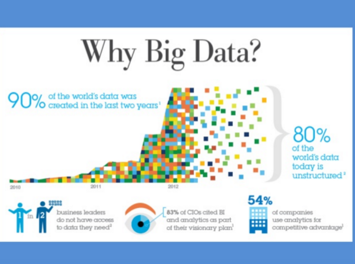]

---
## L'obsession du volume de données

**Problèmes de cette approche** : 
- Estimations guidées par des intérêts commerciaux
- Ne définit pas ce que sont ces données
- Résume le big data au Volume
- Explique mal la mise en données du monde

---
## Les promesses du big data

Kitchin (2014) résume les promesses du big data : 
- **“Governing people”** : dans la continuité de la statistique, améliorer la connaissance de l’administration et prédire les crimes

- **“Managing organisations”** : améliorer le fonctionnement de toutes les composantes de l’organisation par l’exploitation des données

- **“Leveraging value and producing capital”** : micro-ciblage marketing, optimisation des magasins et des opérations, efficience de la chaine

- **“Creating Better places”** : gouverner les villes avec des données (smart city) 

- **Un nouveau paradigme scientifique** : une nouvelle ère guidée par les corrélations

---
## Linked data
.pull-left[
* poussé par W3C et Tim Berners-Lee
* Web sémantique / web des données
* RDF / SPARQL
* wikidata => http://projetjourdain.org/network/index.html
]
.pull-right[]

---
[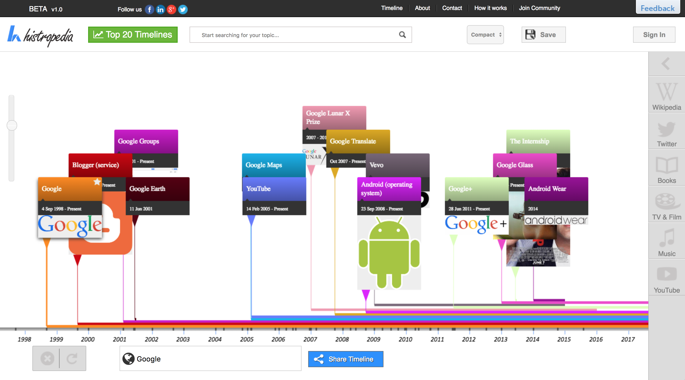](http://histropedia.com/timeline/3jrttpg9bg0t/Google)

---
## API
.pull-left[
- Application Programming Interface => un programme vu de la surface

- les machines parlent aux machines

- donnée dynamique => ouverture potentiellement limitée et contrôlée 

- un exemple : [overpass turbo](https://overpass-turbo.eu/)]
.pull-right[]

---
class: middle, center

# Partie 2 : 
# ouvrir la boite noire de la data science

---
class:middle
## Programme

- Qu'est-ce que la data science ?
- Le data pipeline : acquérir les données, les vérifier, les nettoyer, les analyser, les présenter

---
class:middle
## Bonus

- Data visualisation : quel format et quel outil choisir pour quelle fonction ?
- Modéliser pour prédire : introduction au machine learning et deep learning

---
class: middle, center, inverse

# Qu'est-ce que la data science ?

---
## Au commencement était la statistique

- une vieille science (18e siècle), pour aider les États (_Statistik_) mais aussi des entreprises privées (au départ, les assureurs => actuariat)

- fondée sur les probabilités

- faite par des mathématiciens

- forte dimension théorique

---
## Au commencement était la statistique

<iframe src="http://giphy.com/embed/9ADoZQgs0tyww" width="100%" height="450" frameBorder="0" class="giphy-embed" allowFullScreen></iframe><p><a href="http://giphy.com/gifs/obama-awesome-statistics-9ADoZQgs0tyww">via GIPHY</a></p>

---
## Au commencement était la statistique

> I keep saying the sexy job in the next ten years will be statisticians. People think I’m joking, but who would’ve guessed that computer engineers would’ve been the sexy job of the 1990s?

Hal Varian (Chief economist, Google), _The McKinsey Quarterly_, January 2009

---
## Data science is the new statistics?

> “I think data-scientist is a sexed up term for a statistician”

[Nate Silver](http://www.statisticsviews.com/details/feature/5133141/Nate-Silver-What-I-need-from-statisticians.html)

---
## Data science is the new statistics?

[.reduite[.center[]]](http://www.prooffreader.com/2016/09/battle-of-data-science-venn-diagrams.html)

---
## Le rôle de l'informatique

- statistique classique : les problèmes doivent pouvoir être résolus de manière analytique (d'où le succès du [fréquentisme](https://fr.wikipedia.org/wiki/Interpr%C3%A9tations_de_la_probabilit%C3%A9#Fr%C3%A9quentisme))

- le développement de la puissance de calcul permet de résoudre des problèmes statistiques par la simulation ([MCMC](https://fr.wikipedia.org/wiki/M%C3%A9thode_de_Monte-Carlo_par_cha%C3%AEnes_de_Markov))

---
## Développement de la puissance de calcul

[.reduite[.center[]]](http://visual.ly/infographic-about-computers)

---
## Développement de la capacité de stockage

[.reduite[.center[]]](https://twitter.com/alicemazzy/status/655306196128280576?ref_src=twsrc%5Etfw)


---
## Développement de la capacité de stockage

[.reduite[.center[]]](https://aws.amazon.com/blogs/aws/aws-snowmobile-move-exabytes-of-data-to-the-cloud-in-weeks/)

---
## Développement de la capacité de stockage

[.reduite[.center[]]](https://aws.amazon.com/blogs/aws/aws-snowmobile-move-exabytes-of-data-to-the-cloud-in-weeks/)

???

Jusqu'à 100 Po par camion. 1 Po = 1000 To

---
## Développement de la capacité de stockage

[.reduite[.center[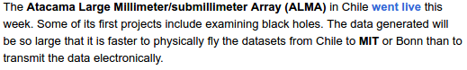]]](https://aws.amazon.com/blogs/aws/aws-snowmobile-move-exabytes-of-data-to-the-cloud-in-weeks/)


---
## La simulation, méthode reine d'estimation statistique 

Monte Carlo Markov Chain (MCMC) : papier de Metropolis et Ulam (1949)

http://chifeng.scripts.mit.edu/stuff/mcmc-demo/#HamiltonianMC,banana

---
class:inverse, center, middle

# Analyse, modélisation, machine learning

---
## Que fait-on une fois qu'on a des données ?

- Exploratory Data Analysis (Tukey, 1977)
  * pas d'hypothèse préalable à tester, plutôt pour générer des hypothèses
  * rôle de la datavisualisation

- test d'hypothèse

---
## Que fait-on une fois qu'on a des données ?

.reduite[.center[]]

---
## Que fait-on une fois qu'on a des données ?

.reduite[.center[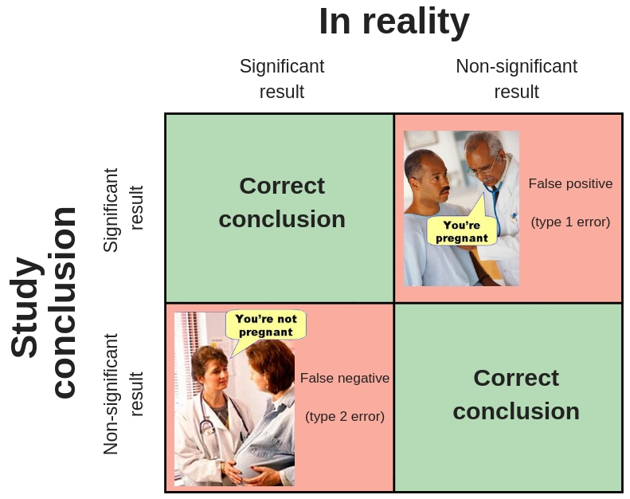]]

https://www.nutritiontactics.com/strength-training-studies-underpowered-ironic-muscle-hypertrophy-stats-explained/

---
## Que fait-on une fois qu'on a des données ?

- Exploratory Data Analysis (Tukey, 1977)
  * pas d'hypothèse préalable à tester, plutôt pour générer des hypothèses
  * rôle de la datavisualisation

- test d'hypothèse

- **modèle**

---
class: center, middle, inverse

# L'écosystème de la data science


---
## Bases de données

Marché de ~ 25 milliards USD

* géants historiques: Oracle, Microsoft

* MySQL, PostgreSQL, SQLite...

* BDD orientées colonnes : MonetDB...

* BDD NoSQL : MongoDB, CouchDB, BigTable (Google), Neo4j, Redis...

---
## Bases de données distribuées : Hadoop / MapReduce

* Framework Hadoop / Cloudera, basé sur :
  * HDFS (Hadoop Distributed File System) pour le stockage et
  * MapReduce pour le calcul
* Alternative: Apache Spark travaille en mémoire vive => 10 à 100x plus rapide que Hadoop


$+$ : Permet une réelle scalabilité (ajoutons des nœuds)

$-$ : Contraint fortement les algorithmes pouvant être utilisés, qui doivent être parallélisables
(ex : Analyse en Composantes Principales => c'est compliqué)

---
## Langages

- Java
- Python
- R
- Scala
- Julia
- SQL
- C / C++
- ...

---
## Logiciels d'analyse et de visualisation de données

* BI: Tableau (racheté par Salesforce 2019/08)

* Data science: Dataiku

* Machine Learning: Azure Machine Learning Studio de Microsoft

---
## La révolution par le GPU

* L'explosion du deep learning repose en partie sur l'exploitation de cartes graphiques puissantes (GPU) développées à l'origine pour les jeux vidéo et la modélisation 3D

* Nvidia, leader mondial des GPU, développe maintenant aussi des bibliothèques de data science / dataviz ("Open GPU Data Science"): https://rapids.ai/
  * entre 10x et 1000x plus rapide (!) selon les algorithmes

.reduite[.center[]]

---
## La révolution par le GPU

.reduite[.center[]]


---
## Bonus: Une carte interactive 

http://xyz.insightdataengineering.com/blog/pipeline_map.html


---
class: center, middle, inverse

# Le data pipeline

---

.reduite[.center[]]


---
## Définir les données dont on a besoin

.center[]

---
## Trouver les données dont on a besoin

.center[]

???
Où cherchez-vous vos données ?

- dépôts internes
- CDO
- dépôts externes
- data brokers
- etc.

---
## Acquérir les données

.center[]

???

Connecteurs
ETL : ex Talend, Logstash


---
## Vérifier les données

.center[]


???

Importance d'un sanity check

---
## Vérifier les données

.center[[](http://www.erogol.com/ml-work-flow-part-4-sanity-checks-data-spliting/)]


---
## Nettoyer les données

.center[]


???

Paradigme du *tidy data*

OpenRefine

---
## Analyser les données

.center[]

---
## Communiquer les résultats

.center[]

???

dataviz
reproducible research
appli
dashboard
etc.

---

class: inverse, center, middle

# Pratique: Transparence Santé

---

## Transparence Santé

.reduite[.center[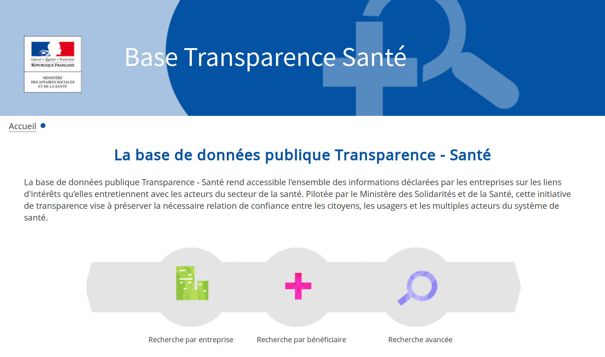]]

---

### Exploration du jeu de données

Lien direct: <https://www.transparence.sante.gouv.fr/exports-etalab/exports-etalab.zip>

* Combien d'entreprises déclarantes?

* Combien d'avantages, conventions, rémunérations ?

---
### Outils Unix

```sh
# nb entreprises
head -n 5 ~/datasets/transparence-sante/2018-11-24/entreprise_2018_11_24_04_00.csv
wc -l ~/datasets/transparence-sante/2018-11-24/entreprise_2018_11_24_04_00.csv
# nb avantages
head -n 5 ~/datasets/transparence-sante/2018-11-24/declaration_avantage_2018_11_24_04_00.csv
wc -l ~/datasets/transparence-sante/2018-11-24/declaration_avantage_2018_11_24_04_00.csv
# id. conventions et remunerations
```

Au 24 novembre 2018:
* entreprises: 2.812
* avantages: 9.604.936
* conventions: 4.123.166
* rémunérations: 280.981

---
## Alternative: miller

<https://github.com/johnkerl/miller>

> Miller is like awk, sed, cut, join, and sort for name-indexed data such as CSV, TSV, and tabular JSON.  
> Miller is multi-purpose: it’s useful for data cleaning, data reduction, statistical reporting, devops, system administration, log-file processing, format conversion, and database-query post-processing.  
> Miller complements data-analysis tools such as R, pandas, etc.: you can use Miller to clean and prepare your data. While you can do basic statistics entirely in Miller, its streaming-data feature and single-pass algorithms enable you to reduce very large data sets.

<https://johnkerl.org/miller/doc/index.html>

Installation:
```sh
apt-get install miller
```

---
## Exploration avec miller
```sh
# nb entreprises
mlr --csv cat -n then tail -n 1 ~/datasets/transparence-sante/2018-11-24/entreprise_2018_11_24_04_00.csv
# nb avantages
mlr --csv --ifs ';' cat -n then tail -n 1 ~/datasets/transparence-sante/2018-11-24/declaration_avantage_2018_11_24_04_00.csv
# id. conventions et remunerations
```

* entreprises: 2.812
* avantages: 9.604.485
* conventions: 4.120.314
* rémunérations: 280.940

---
## `wc -l != mlr cat -n` ?

* `wc -l` compte les caractères `\n` (attention si la dernière ligne d'un fichier ne se termine pas par ce caractère!) ;
`cat -n` compte les lignes, séparées par `\n`.

* `mlr cat -n` compte les entrées, champ par champ, en tenant compte des guillements doubles utilisés pour protéger certaines valeurs textuelles.

Donc?

---
## `wc -l != mlr cat -n` !
* Certains champs de texte libre contiennent du texte incluant des `\n` (multiline strings).

```sh
grep -A1 --color=always ';"[^";]*$' ~/datasets/transparence-sante/2018-11-24/declaration_avantage_2018_11_24_04_00.csv|less
```

---

## Exploration avec pandas
```python
import pandas as pd
df_a = pd.read_csv("~/datasets/transparence-sante/2018-11-24/declaration_avantage_2018_11_24_04_00.csv", sep=';')
df_a.shape
# (9604485, 36)
```

Pourquoi ne pas utiliser directement pandas?

---
## miller vs pandas: CPU

```sh
time mlr --csv --ifs ';' cat -n then tail -n 1 ~/datasets/transparence-sante/2018-11-24/declaration_avantage_2018_11_24_04_00.csv
# 38,53s user 1,10s system 99% cpu 39,636 total
```

```python
from time import time
t0 = time() ; df_a = pd.read_csv("~/datasets/transparence-sante/2018-11-24/declaration_avantage_2018_11_24_04_00.csv", sep=';') ; t1 = time() ; print(t1 - t0)
# 53.411545515060425
```

---
## miller vs pandas: RAM

```sh
/usr/bin/time -v mlr --csv --ifs ';' cat -n then tail -n 1 ~/datasets/transparence-sante/2018-11-24/declaration_avantage_2018_11_24_04_00.csv
# Maximum resident set size (kbytes): 2754560
# soit environ 2.6 GB
```

```python
df_a.info(memory_usage='deep')
# dtypes: int64(1), object(35)
# memory usage: 18.3 GB
```

---
## pandas: moins de RAM

Pour chaque colonne, un autre dtype est-il possible?
```python
# nb valeurs non nulles, nb uniques,
# valeur la plus fréquente et sa fréquence
df_a.describe(include='all').transpose()[['count', 'unique', 'top', 'freq']]
```
15 colonnes contiennent beaucoup d'occurrences d'un nombre restreint de valeurs distinctes.
Sémantiquement, elles semblent correspondre à des **variables catégorielles**.

---
## pandas: dtypes

```python
cols_desc = df_a.describe(include='all').transpose()[['count', 'unique', 'top', 'freq']]
```

```python
cat_cols = cols_desc[cols_desc['unique'] < 100].index.values.tolist()
cat_dtypes = {x: 'category' for x in cat_cols}
df_a = df_a.astype(cat_dtypes, copy=False)
# verif memoire
df_a.info(memory_usage='deep')
# dtypes: category(15), int64(1), object(20)
# memory usage: 9.9 GB
```

---
## pandas: dump dtypes

`read_csv` a un argument optionnel qui permet de spécifier le dtype d'une ou plusieurs colonnes.
L'inférence de type est désactivée pour ces colonnes.

```python
# on exporte dans un json le dtype des colonnes pour
# éviter (à soi ou aux autres) de refaire ce travail
# préliminaire
import json
col_dtypes = df_a.dtypes.astype(str).to_dict()
with open('data/avantage_dtypes.json', mode='w') as f:
    json.dump(col_dtypes, f)
```

---
## pandas: `read_csv(dtype=...)`

Nouvelle session:
```python
import pandas as pd
import json
# lecture des dtypes
with open('data/avantage_dtypes.json', mode='r') as f:
    col_dtypes = json.load(f)
df_a = pd.read_csv("declaration_avantage_2018_11_24_04_00.csv", sep=';', dtype=col_dtypes)
```

---
## pandas: et pour les autres colonnes?

```python
df_a.describe(include='object').transpose()[['count', 'unique', 'top', 'freq']]
```
* variables catégorielles intéressantes (RAM) si unique << count
  - toutes sauf `ligne_identifiant`, `avant_convention_lie`, `benef_denomination_sociale`?

* `entreprise_identifiant` est sûrement une clé étrangère (table des entreprises) ; `denomination_sociale` doit correspondre également

* `benef_adresse{1..4}` sont à interpréter ensemble

```python
df_a = df_a.astype({'entreprise_identifiant': 'category', 'denomination_sociale': 'category'}, copy=False)
# [...] memory usage: 8.8 GB
# etc.
df_a['avant_date_signature'] = pd., format='%d/%m/%Y')
```

---
## pandas: dates

`avant_date_signature` doit être une date, utilisons le dtype adéquat:
```python
df_a['avant_date_signature'] = pd.to_datetime(df_a['avant_date_signature'], format='%d/%m/%Y')
# OutOfBoundsDatetime: Out of bounds nanosecond timestamp: 17-10-17 00:00:00
# solution: errors='coerce' ou errors='ignore'
```

```sh
mlr --csv --ifs ';' grep "17/10/0017" then cat -n ~/datasets/transparence-sante/2018-11-24/declaration_avantage_2018_11_24_04_00.csv
```

---
## Problème de qualité 1: valeurs incorrectes

* 30 entrées contiennent cette date erronée, toutes pour des repas offerts par les laboratoires Servier à des cardiologues de différents hôpitaux (le 17/10/2017?).

* Explications possibles (+/- optimistes): erreurs de saisie indépendantes, erreurs de saisie liées (événement? saisie groupée?) ; les dates déclarées correctes en apparence sont-elles fiables?

* Autre exemple: `benef_ville`="MARSEILLLE"

---
## Problème de qualité 2: valeurs de remplissage

```python
df_a["benef_identifiant_valeur"].value_counts()
```

* Les valeurs les plus fréquentes ressemblent à de faux identifiants ou des valeurs de remplissage: [SO], SO (sans objet?), 0, [AUTRE], 10000000000, 00000000000, `BENEF_IDENTIFIANT_VALEUR`, [BR], NON RENSEIGNE, [0], 9999, `.`, INFORMATION NON DISPONIBLE, 10000000001, MANIPULATEUR EN RADIOLOGIE.

* Vérification manuelle: "508331303" est un SIREN valide (ok).

---
## Bilan du jeu de données

* Volumétrie importante: > 13 millions d'entrées

* Forte hétérogénéité et faible qualité dues à:
  - mode de déclaration (peu de contrôles à la soumission),
  - nombre d'entreprises déclarantes (> 2.800).

---
class: inverse, center, middle

# Travailler avec des données "sales"

---

## Data: the good, the bad...

.reduite[.center[]]

.reduite[.center[]]

---

## Tidy data

> "Happy families are all alike; every unhappy family is unhappy in its own way." –– Leo Tolstoy

> "Tidy datasets are all alike, but every messy dataset is messy in its own way." –– Hadley Wickham

.reduite[.center[]]

---

## Tidy data: références

.reduite[.center[]]

* Wickham, Hadley, and Garrett Grolemund. R for data science: import, tidy, transform, visualize, and model data. " O'Reilly Media, Inc.", 2016.
  - disponible gratuitement en ligne: <https://r4ds.had.co.nz/>
  - chapitre "Tidy Data": <https://r4ds.had.co.nz/tidy-data.html>

---

## Tidy data: références

.reduite[.center[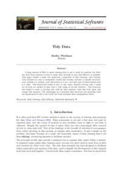]]
* Hadley Wickham. Tidy data. The Journal of Statistical Software, vol. 59, 2014.
  - <http://vita.had.co.nz/papers/tidy-data.html>

---
## Data: ... and the ugly

.reduite[.center[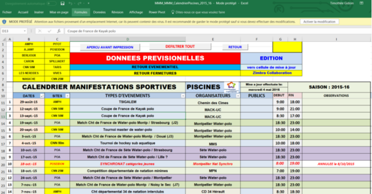]]

---
## Data: ... and the ugly (bis)

.reduite[.center[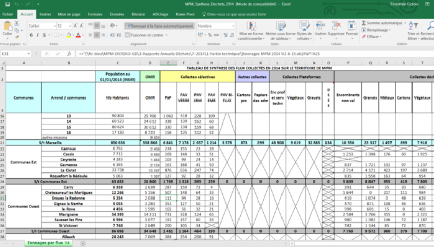]]

---

## Rendre les données exploitables pour la dataviz

Lisa Charlotte Rost: "How to prepare your data for analysis and charting in Excel & Google Sheets"

https://blog.datawrapper.de/prepare-and-clean-up-data-for-data-visualization/

---

## OpenRefine
<http://openrefine.org>

Outil de correction semi-automatique itératif:

* travail par facettes/filtres

* heuristiques de clustering: collision de clés, plus proches voisins (plusieurs variantes pour chacune)

* on sélectionne les fusions à réaliser

* plus éventuellement données externes (wikidata)

=> Produire rapidement une version corrigée d'un jeu de données (corrections simples).

---

## Conclusion
* Les problèmes de qualité sont un frein majeur à la publication et à la réutilisation de données (ouvertes).

* Ils sont issus du **travail invisibilisé de production des données**, dont on retrouve quelques traces dans la documentation et dans les données elles-mêmes.

* L'exploitation de jeux de données "sales" nécessite leur nettoyage manuel ou semi-automatique (utilisation d'outils de correction comme OpenRefine)

---
class: inverse, center, middle

# Travailler avec des données non-structurées

---

## Données non structurées

* Fichiers textes et documents (.doc, .pdf, .html, .ppt)
* Courriels
* Données issues des réseaux sociaux
* Images
* Fichiers sons
* Vidéos
* Logs de serveurs, sites, applications

Comment extraire les nombreuses informations contenues dans ces données non-structurées?

---
## Difficultés

.reduite[.center[]]

<!-- In the 60s, Marvin Minsky assigned a couple of undergrads to spend the summer programming a computer to use a camera to identify objects in a scene. He figured they'd have the problem solved by the end of the summer. Half a century later, we're still working on it. -->

---
## Branches de l'IA

* Vision par ordinateur (Computer Vision)
  - détection d'objet (Object Detection)
  - reconnaissance optique de caractères (Optical Character Recognition)

* Traitement automatique du langage naturel (Natural Language Processing)

Progrès de la recherche dans ces branches de l'IA => amélioration des performances des systèmes

---
## Panama papers

* 11.4 M fichiers, 2.6 To données
* "Soit plusieurs décennies de lecture jour et nuit si l’on veut aller d’un bout à l’autre de la base de données – sans compter la complexité de certains dossiers."

.reduite[.center[]]

---
## Stack technique ICIJ

* extraction du texte par OCR avec Tesseract,
* recherche de termes avec Talend,
* indexation des résultats avec Apache Solr,
* tokenization, filtrage, stemming, clustering de termes avec RapidMiner,
* classification automatique de documents avec RapidMiner.

<https://www.icij.org/blog/2018/08/how-machine-learning-is-revolutionizing-journalism/>

---
## Limites

* Données:
  - Fautes d'orthographe
  - Variations de la graphie
* Masse de données à analyser:
  - Filtrer les documents peu intéressants,
  - Stratégies de classification plus élaborée,
* Systèmes:
  - Erreurs d'OCR
  - Erreurs de NER
  - NB: erreurs en cascade => effet multiplicatif

---
## Data pipeline

.reduite[.center[]]

---
## Named Entity Recognition

Schéma d'annotation des dumps Wikipedia:

* PER:	Named person or family.
* LOC:	Name of politically or geographically defined location (cities, provinces, countries, international regions, bodies of water, mountains).
* ORG:	Named corporate, governmental, or other organizational entity.
* MISC:	Miscellaneous entities, e.g. events, nationalities, products or works of art.

D'autres schémas d'annotation plus détaillés existent.

Vous pouvez élaborer vos propres schémas d'annotation métier, dérivés ou non de schémas standard, et annoter des données.

---

## Annotation de données avec Prodigy

.reduite[.center[]]

<https://prodi.gy>

---

class: inverse, center, middle

# Workshop : Introduction à la data visualisation

[datactivist
.coop/odl_paca](https://datactivist.coop/odl_paca)

---
class: center, middle, inverse

# Modéliser

---
## Pourquoi modéliser ?

.reduite[.center[]]


---
## Pourquoi modéliser ? Les ["deux cultures"](https://projecteuclid.org/download/pdf_1/euclid.ss/1009213726)

- pour analyser et expliquer

- pour prédire

---
## Pourquoi modéliser ? Les ["deux cultures"](https://projecteuclid.org/download/pdf_1/euclid.ss/1009213726)

- pour analyser et expliquer (**statistiques classiques, économétrie**)

- pour prédire (**machine learning, IA...**)

---
## Modéliser pour analyser

- un modèle réduit de la réalité

- isoler le rôle de chaque variable

- raisonner "toutes choses égales par ailleurs" (*ceteris paribus*)

---
## Modéliser pour analyser

Modéliser, c’est mettre en relation une *variable expliquée*
(dépendante / prédite) et une ou plusieurs *variables explicatives*
(indépendantes / prédicteurs).

$$ Y = f(X_1, X_2, X_3, ..., X_n) $$

L’estimation du modèle consiste à estimer la valeur des paramètres
(ou coefficients). Le cas du modèle linéaire :

$$ Y = α + β_1X_1 + β_2X_2 + β_3X_3 + · · · + β_nX_n + ε $$

---
## Modéliser pour analyser

Implique de faire des hypothèses sur la spécification du modèle :

- variables explicatives

- distribution des erreurs

---
## Les distributions

- distribution théorique (ex : distribution normale)

- distribution empirique

http://shiny.stat.calpoly.edu/Prob_View/

---
## All models are wrong, some are useful

> Since all models are wrong the scientist cannot obtain a "correct" one by excessive elaboration. On the contrary following William of Occam he should seek an economical description of natural phenomena. 

[George Box](https://dx.doi.org/10.1080%2F01621459.1976.10480949)

---
## All models are wrong, some are useful

.reduite[.center[]]

---
## Estimation d'un modèle

Dans le cas d'un modèle linéaire => méthode des moindres carrés ordinaires (MCO/OLS)

http://setosa.io/ev/ordinary-least-squares-regression/

---
## Attention !

- Les modèles de régression linéaire supposent que les relations
sont *linéaires* et *additives*.

- Les *résidus* sont supposés être *normalement distribués*.

- Les coefficients ne sont *pas standardisés* (on ne peut pas les
comparer entre eux).

- Les coefficients s’interprètent *relativement à l’unité de la variable dépendante*.

---
## Attention !

- Les coefficients estiment l’effet d’une variable indépendante
sur la variable dépendante *toutes choses égales par ailleurs*,
c’est-à-dire en neutralisant l’effet des autres variables.

- La qualité globale du modèle peut être quantifié au travers du
$R^2$, qui représente la part de variance (de la variable
dépendante) expliquée.

- Pour les variables indépendantes catégoriques, on estime un
coefficient par modalité, à l’exception de la première
(baseline).

---
## Modèles statistiques

Compromis entre intelligibilité et fidélité aux données

---
## Underfitting et overfitting

.reduite[.center[]]

---
## Underfitting et overfitting

- différencier données d'apprentissage et données de test 

- n'utiliser les données de confirmation (test) qu'une fois 

---
## Extrapolation

[.reduite[.center[]]](http://r4ds.had.co.nz/model-basics.html)

---
## Et le machine learning alors ?

- Fondamentalement, modélisation et machine learning ne sont pas différents, du point de vue d'un statisticien : modéliser un $Y$ en fonction d'un vecteur de $X_i$

- une des différences principales toutefois : veut-on prévoir ou comprendre/analyser ?

- et donc : peut-on, veut-on interpréter les coefficients ?

- en pratique : machine learning porte généralement sur des données plus complexes que la modélisation traditionnelle

- souvent beaucoup de valeurs manquantes 

---
## Et le machine learning alors ?

.reduite[.center[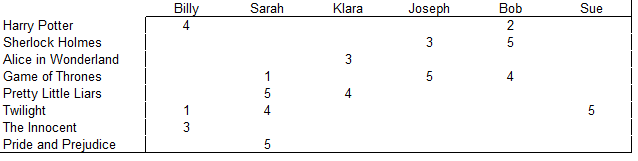]]

---
## Concepts de machine learning

- Apprentissage supervisé vs non supervisé 

- Apprentissage supervisé : il faut des données déjà classées/étalonnées. Souvent à la main ! => *#digitallabour*

---
## Apprentissage supervisé 

[.reduite[.center[]]](https://fakecaptcha.com)

---
## Apprentissage supervisé

[.reduite[.center[]]](https://cquest.hackpad.com/OpenSolarMap-9oMiYswLksF)

---
## Apprentissage supervisé

[.reduite[.center[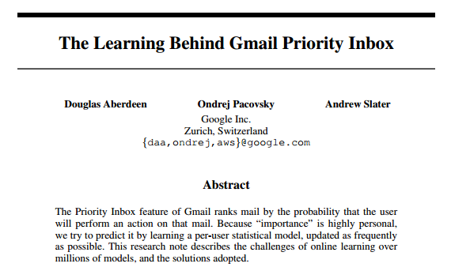]]](https://static.googleusercontent.com/media/research.google.com/en//pubs/archive/36955.pdf)

---
## Apprentissage non supervisé 


- problème majeur : réduction de la dimensionnalité

- jeux de données à très haute dimensionnalité : impossible à explorer visuellement. Comment simplifier l'information et la résumer ?

.reduite[.center[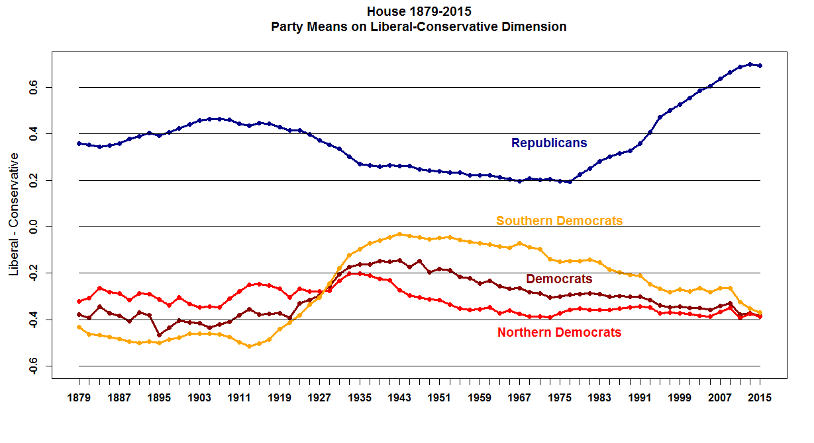]]

---
## Apprentissage non supervisé 

https://gallery.shinyapps.io/LDAelife/

---
class: inverse, center, middle

# Merci !

#<mathieu@datactivist.coop>

# Évaluation de  la formation
