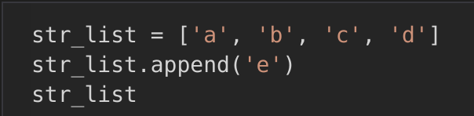
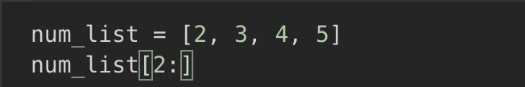
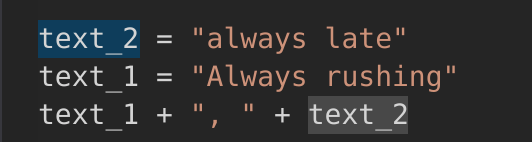
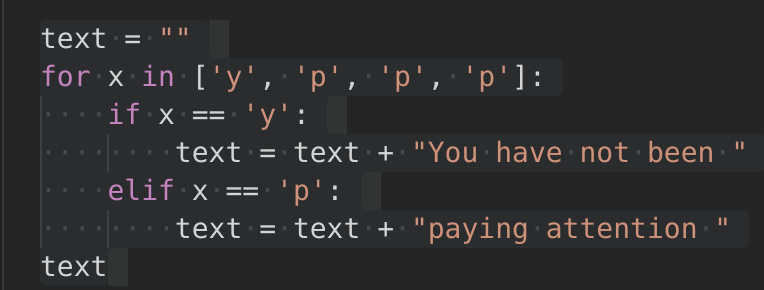
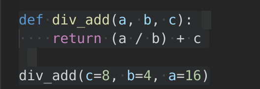

layout: true

<style>
.remark-slide-number {
  position: inherit;
}

.remark-slide-number .progress-bar-container {
  position: absolute;
  bottom: 0;
  height: 4px;
  display: block;
  left: 0;
  right: 0;
}

.remark-slide-number .progress-bar {
  height: 100%;
  background-color: #e95459;
}

</style>


---
## Rules

- Some questions are "real" multiple choice questions ;
- The other questions (python code) have a unique correct answer.
- **You are not allowed to type and execute the Python code snippets.**
- Write your answers in a CSV file `yourlastname.csv`:
```sh
question,answer
A,1
B,4
C,2
```
- Send me your CSV file at <mathieu@datactivist.coop>

---
## A. What does a Jupyter notebook contain?

1. Code cells

2. Text cells

3. Files

---
## What does Jupyter display when a cell with this Python code is run?

---
## B.



1. ['a', 'b', 'c', 'd']

2. ['a', 'b', 'c', 'e']

3. ['a', 'b', 'c', 'd', 'e']

4. 'abcde'

---
## C.



1. [2, 3, 4, 5]

2. [3, 4, 5]

3. [4, 5]

4. [5]

---
## D.



1. "always late Always rushing"

2. "always late, Always rushing"

3. "Always rushing always late"

4. "Always rushing, always late"

---
## E.



1. "You have not been paying attention"

2. "You have not been paying attention paying attention paying attention "

3. "yYou have not been ppaying attention ppaying attention ppaying attention "

4. "yppp"

---
## F.



1. 11.0

2. 12.0

3. 18.0

4. 20.0

---
## G. "It is possible for a given column in a DataFrame to contain text values on some rows, and numeric values on other rows."

1. True

2. False

---
## H. How can you filter your DataFrame to keep only the entries where the value for 'fat_100g' is higher than 20 g ?

1. df["fat_100g"] > 20

2. df[df["fat_100g"] > 20]

---
## I. How can you filter your DataFrame to keep only the three columns "fat_100g", "sugars_100g", "proteins_100g" ?

1. df["fat_100g", "sugars_100g", "proteins_100g"]

2. df[["fat_100g", "sugars_100g", "proteins_100g"]]

---
## J. How can you filter your DataFrame to keep only the entries where the column "ingredients_txt" (with the list of all ingredients) contains, (among other ingredients) "butter" ?

1. df[df["ingredients_txt"].str.contains("butter")]

2. df[df["ingredients_txt"] == "butter"]

---
## K. How do you compute, for each value in the column 'fat_100g', the difference between that value and the mean of the whole column ?

1. df["fat_100g"] - df["fat_100g"].mean()

2. df[df["fat_100g"] - df["fat_100g"].mean()]

---
## L. The Nutri-Score **grade** is :

1. a numerical variable (ex values: 1, -8, 13 etc)

2. an (ordered) categorical variable (ex values : 'a', 'b', 'c' etc)

---
## M. **Distribution plots** enable to visualize the distribution of a numerical variable.

1. True

2. False

---
## N. A numerical variable and a categorical variable can be both represented simultaneously on a data visualization.

1. True

2. False

---
## O. It is impossible to represent more than two variables simultaneously on the same data visualization.

1. True

2. False

---
## P. There is exactly one way to visualize the distribution of any one or two given variables.

1. True

2. False

---
class: inverse, center, middle

# I hope that went well.

Please send me your CSV file at: [mathieu@datactivist.coop](mailto:mathieu@datactivist.coop)


